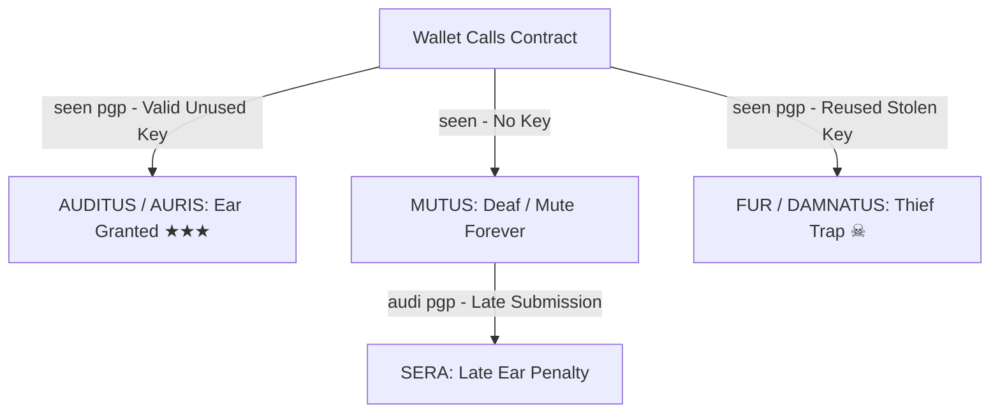

# THEY · SEEN // The Complete Deep Dive, Rarity Architecture & Verification Guide
*Target Contract: `0x3286e6525A38cD1d277ECaF435b156c0cc892C29` (Ethereum Mainnet)*  
*Canonical Protocol URL: [theyarefound.com](https://theyarefound.com)*  
*Engine & Cryptographic Vault: [seen-minter-dapp-xvmm.vercel.app](https://seen-minter-dapp-xvmm.vercel.app)*

---

## 1. Executive Summary & Philosophy

> *"viderunt te antequam esses. this is not a token. there is nothing to buy. happy hunting."* — `seen.sol`

`they · seen` is an alternate reality cryptographic experiment and permanent on-chain inscription protocol deployed on Ethereum Mainnet. Unlike standard speculative NFT projects, `they · seen` is:
1. **100% Soulbound (`non transferibilis`)**: Once minted to an address, it can never be transferred, traded, sold, or extracted (`_update()` reverts on any non-zero source address).
2. **One Soul Per Wallet (`iam visus`)**: A wallet can only ever hold a single *signum* (Token ID). There is no second try.
3. **Calldata Provenance**: The mint function embeds your full ASCII-armored OpenPGP Public Key block directly into the Ethereum transaction calldata, making your cryptographic identity permanently readable on the blockchain ledger.
4. **Asynchronous 8-Epoch Survey**: The visual map, Latin soul title, and rarity characteristics are calculated by an autonomous archivist bot (`archivum`) that audits your wallet’s historical Ethereum lifetime across eight epochs.

---

## 2. Smart Contract Mechanics & The 4 Soul Classifications

The contract (`Seen.sol`) classifies every soul into four rigid states based on how and when you interact:



### 1. Auditus (`auris = true`, `sera = false`) — The Ear (Pure Genesis)
* **How it is obtained**: Minting via Function #9: `seen(string calldata pgp)` using a fresh, previously unseen ASCII-armored GPG public key.
* **On-Chain Effect**: 
  - `clavisUsed[keccak256(pgp)] = true`
  - `auris[signum] = true`
  - Emits `Visus(qui, signum)` and `Auditus(signum)`
* **Status**: Top-tier recognition. The archive acknowledges that you were born with an ear.

### 2. Mutus (`auris = false`) — The Deaf / Mute
* **How it is obtained**: Minting via Function #8: `seen()` (without supplying a PGP key).
* **On-Chain Effect**: Receives a token ID, but `auris` remains `false`.
* **Status**: You were seen, but you have no ear. The archive cannot speak to you.

### 3. Sera (`sera = true`) — The Late Ear
* **How it is obtained**: Calling `audi(string calldata pgp)` after having previously minted with no key.
* **On-Chain Effect**: 
  - `auris[signum] = true`
  - `sera[signum] = true`
  - Emits `Sera(signum)`
* **Status**: Mercy is granted, but your lateness is permanently recorded on-chain: *"mercy is granted; the lateness is not forgotten."*

### 4. Fur / Damnatio (`fur = true`, `damnatus = true`) — The Thief's Trap
* **How it is obtained**: Submitting a PGP key whose Keccak-256 hash matches an already-used key in `clavisUsed`.
* **On-Chain Effect**:
  - The transaction does **NOT** revert (you still pay gas).
  - The contract mints a certificate token marked `fur[signum] = true`.
  - Your wallet address is permanently blacklisted: `damnatus[msg.sender] = true`.
  - The generated visual map is ruined and only displays the word **"FUR"**.
  - All future calls to `audi()` or `seen()` will permanently revert with `"damnatus es"`.

---

## 3. The 8-Epoch Survey & Generative Map Rarity

Your token's visual appearance and Latin soul title are **not** determined by random seed at mint. Instead, they are determined by an on-chain packed 256-bit word (`descriptio`) written by the surveyor address (`archivum` = `0x6E9782923e4D8C8E13e9041A6d6e210BacdcAc8a`).

### Structure of the 256-bit `descriptio` Word:

$$\text{Bit 0 to 127: } 8 \times 16\text{-bit Epoch Activity Weights} \quad|\quad \text{Bit 128 to 191: First Seen Block (64-bit)} \quad|\quad \text{Bit 192 to 223: Total TX Count (32-bit)}$$

```
[255......................224][223..........192][191...................128][127..................................0]
          Reserved            Total TXs (32b)       First Block (64b)            8 Epoch Activity Slots (16b each)
                               summa(signum)         primus(signum)             aetas(signum, 0) .. aetas(signum, 7)
```

### Visual Map Generation & Isometric City Rarity:
1. **Four Stacked Floors**: Each floor visualizes two of your wallet's historical epochs.
2. **City Buildings & Density**:
   - Wallets with rich transaction history across Ethereum epochs build multi-story isometric buildings, spires, and urban density on their floors.
   - Fresh burner wallets or wallets with zero past transactions receive quiet, empty plains.
3. **The Golden Path & The Funnel**: A descending beam leads through each floor down to a lit golden square at the bottom (hypothesized to represent the "Found" state).

---

## 4. Decoding the Status Screen: *"adhuc de te loquimur. redi."*

When you mint a fresh token (e.g. `#78284`) and visit `https://theyarefound.com/78284`, you will see:

```
#78284
if you are to be named, you will be. soon.

visus es, 78284. (you were the 78284th to be seen.)
nondum nominatus es. (you have no name yet.)
adhuc de te loquimur. redi. (we are still speaking of you. check back later.)
```

### Technical Explanation:
* **`visus es`**: Your transaction was mined and confirmed on Ethereum mainnet.
* **`nondum nominatus es`**: The off-chain surveyor bot indexes tokens in batches. At the second of mint, `descriptio[signum] == 0` (i.e. `descriptus(signum) == false`).
* **`adhuc de te loquimur. redi`**: Your token is queued in the archivist's indexing backlog. Once the bot executes `describeMany([78284, ...], [verbum, ...])` on Ethereum, the site dynamically computes your Latin soul name (*ignis*, *ventus*, *cinis*, *culmen*) and renders your full visual map at `https://theyarefound.com/img/78284.png`.

---

## 5. Why Cryptographic Vaulting Matters (Public + Private + Revocation)

In cryptic on-chain puzzles and ARGs:
> *We know what the mint requires today (`public key`), but we do not know what future phases will demand.*

If the creator later asks participants to:
1. **Sign a secret message** on-chain with the corresponding PGP private key to prove ownership of the Ear.
2. **Decrypt a message** broadcast by the archive.
3. **Present a revocation certificate** to cleanse a damnation (`absolvo`).

**If you discard your private key or revocation certificate, your soul is permanently locked.**

Our closed-system architecture generates, stores, and exports the full **Cryptographic Triad**:
- `armoredKey` $\rightarrow$ Armored Public Key (`.pub` / `.asc`)
- `privateKey` $\rightarrow$ Armored Private Key (`.key` / `.sec`)
- `revocationCertificate` $\rightarrow$ Armored Revocation Certificate (`.rev` / `.asc`)

---

## 6. Dashboard Features & Execution Modes

| Feature / Mode | Option 1: Wallet Connect | Option 2: Bulk Burner Mint | Option 3: Vault Studio | Option 4: Admin Registry |
| :--- | :--- | :--- | :--- | :--- |
| **Interface** | MetaMask / Rabby / Native Picker | Autonomous Multi-Key Loop | In-Browser Key Generator | Master Audit Ledger |
| **Gas Strategy** | Native Wallet Low / Priority | Minimum Safe (0.05 Gwei tip) | N/A (Client-Side) | N/A |
| **Key Generation** | Instant On-Demand / Pool | Auto-Pull / On-Demand | Batch (1 to 100 Curve25519) | N/A |
| **Triad Preservation** | Full Public + Priv + Rev | Full Public + Priv + Rev | Master Vault (JSON/TXT) | Export Ledger (CSV/JSON) |
| **Address Binding** | Real-Time Sync | Real-Time Sync | Manual / Auto | Searchable Address Map |
